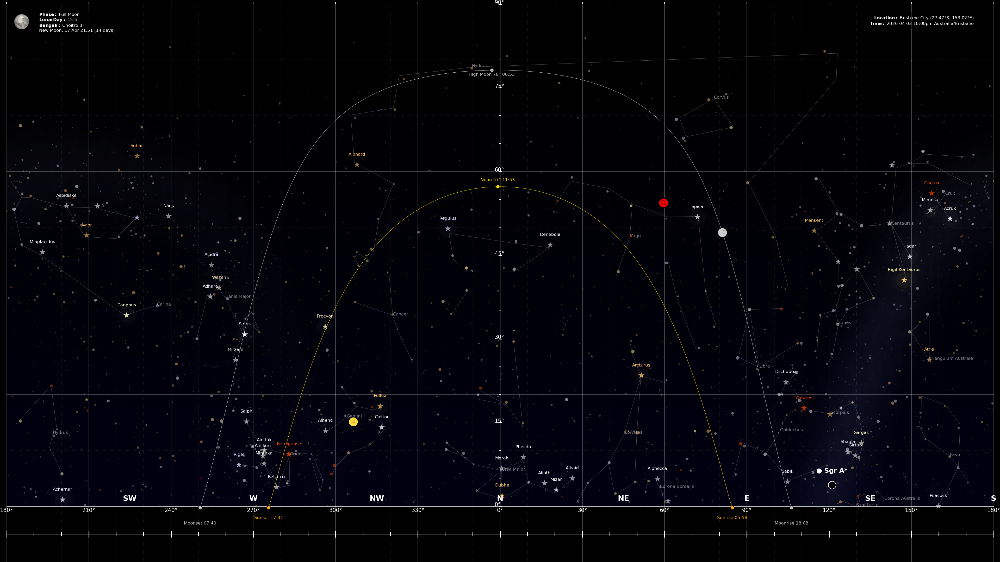

# Sky Map Generator

A Python application that generates accurate night sky maps for use as desktop wallpapers.

## Example



*Generated for Brisbane, Australia. Shows constellation lines, sun and moon arc paths, planets, the Milky Way band along the galactic plane, and bloom halos on the brightest stars.*

## Features

- Accurate planet and star positions using PyEphem ephemeris calculations
- Sun and moon daily path arcs with rise/set/transit markers
- Moon phase display with lunar day and Bengali calendar date
- Constellation lines for configurable zodiac and major constellations
- Rahu and Ketu (lunar nodes) plotting
- Sagittarius A* (galactic center) marker
- Milky Way band rendered as a soft luminous glow with dithered star texture along the galactic plane
- Star bloom/glow halos on the brightest stars for a more naturalistic look
- Configurable resolution (1080p, 1440p, 4K) via config.yaml
- Automatic desktop wallpaper setting (Windows)
- Scheduled wallpaper updates via Windows Task Scheduler (see `wallpaper_scheduler/`)
- Background gradient simulating light pollution near the horizon

### Optional / experimental plotters

The following plotters exist in `plotters/` and can be enabled by uncommenting their
calls in `starmap.py`. They are currently disabled by default to keep the wallpaper
visually clean:

- `nakshatra_plotter.py` — draws the ecliptic with the 27 nakshatra (lunar mansion) divisions and highlights the Moon's current nakshatra
- `deepsky_plotter.py` — renders bright naked-eye deep sky objects (LMC, SMC, Omega Centauri, Carina Nebula, M42, Pleiades, etc.) as soft fuzzy patches
- Atmospheric extinction (dimming and reddening of stars near the horizon) — commented out in `plotters/star_plotter.py`

See `TODO_visual_enhancements.md` for design notes and `comparisons/` for before/after screenshots of each effect.

## Requirements

- Windows 10/11 (the wallpaper setter and the scheduled task use Windows APIs)
- Python 3.10+ — the scheduled task assumes Anaconda at `C:\ProgramData\anaconda3\`. Any 3.10+ install works for manual runs; adjust the path in `wallpaper_scheduler\setup_wallpaper_task.bat` if you use a different Python.
- Packages listed in `requirements.txt`

## Installation

1. Clone the repo and `cd` into it:
   ```bash
   git clone <repo-url> starmap
   cd starmap
   ```
2. Install dependencies:
   ```bash
   pip install -r requirements.txt
   ```
3. Edit `config.yaml` — set your latitude/longitude/timezone and target resolution.
4. Smoke-test a one-shot run:
   ```bash
   python starmap.py --setAsWallpaper
   ```
   The PNG lands in `generated/` and your wallpaper changes.
5. (Optional) Install the hourly scheduled task — see [Automatic wallpaper scheduling](#automatic-wallpaper-scheduling) below.

## Usage

Run the application:
```bash
python starmap.py
```

The application will:
1. Generate a sky map based on your current location and time
2. Display visible planets, stars, constellations, and sun/moon paths
3. Save the image and optionally set it as your wallpaper

## Command Line Arguments

```bash
python starmap.py [options]
```

Options:
- `--date YYYY-MM-DD`     Date in YYYY-MM-DD format (default: current date)
- `--time HH:MM:SS`       Time in HH:MM:SS format (default: now)
- `--lat DECIMAL`         Latitude in decimal degrees (default: -27.47)
- `--lon DECIMAL`         Longitude in decimal degrees (default: 153.02)
- `--elev METERS`         Elevation in meters (default: 0)
- `--timezone TIMEZONE`   Timezone (default: Australia/Brisbane)
- `--output FILENAME`     Output filename (default: starmap.png)
- `--setAsWallpaper`      Set the generated image as desktop wallpaper

Example:
```bash
python starmap.py --date 2024-04-15 --time 20:00:00 --lat 40.7128 --lon -74.0060 --timezone America/New_York --setAsWallpaper
python starmap.py --time 20:00:00 --setAsWallpaper
python starmap.py --lat 35.6762 --lon 139.6503 --timezone Asia/Tokyo --output tokyo_stars.png
python starmap.py --lat 51.5074 --lon -0.1278 --timezone Europe/London --date 2024-12-21 --time 23:00:00
```

## Automatic wallpaper scheduling

The `wallpaper_scheduler/` directory contains `setup_wallpaper_task.bat`, which registers a Windows Task Scheduler job named `StarMapWallpaperUpdater` that regenerates the wallpaper hourly, 24/7.

To install:

1. Open `wallpaper_scheduler\setup_wallpaper_task.bat` and confirm the `PYTHONW` path matches your Python install (default: `C:\ProgramData\anaconda3\pythonw.exe`).
2. Right-click the file → **Run as administrator**.

The task invokes `pythonw.exe starmap.py --setAsWallpaper` directly — no `cmd.exe` window flashes when it fires. Logs are written to `logs/starmap.log` (rotating, 5MB × 5).

To remove the task:
```bash
schtasks /delete /tn "StarMapWallpaperUpdater" /f
```

## Configuration

Edit `config.yaml` to customize:
- Planet colors and symbols (including Rahu/Ketu lunar nodes)
- Constellation filter list
- Star plotting limits (magnitude, label thresholds)
- Sagittarius A* display settings
- Resolution (width, height, DPI)
- Maximum generated images to retain